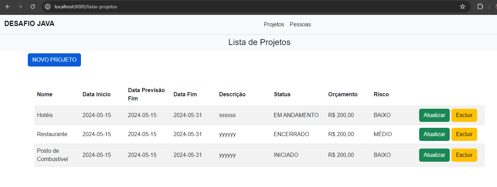
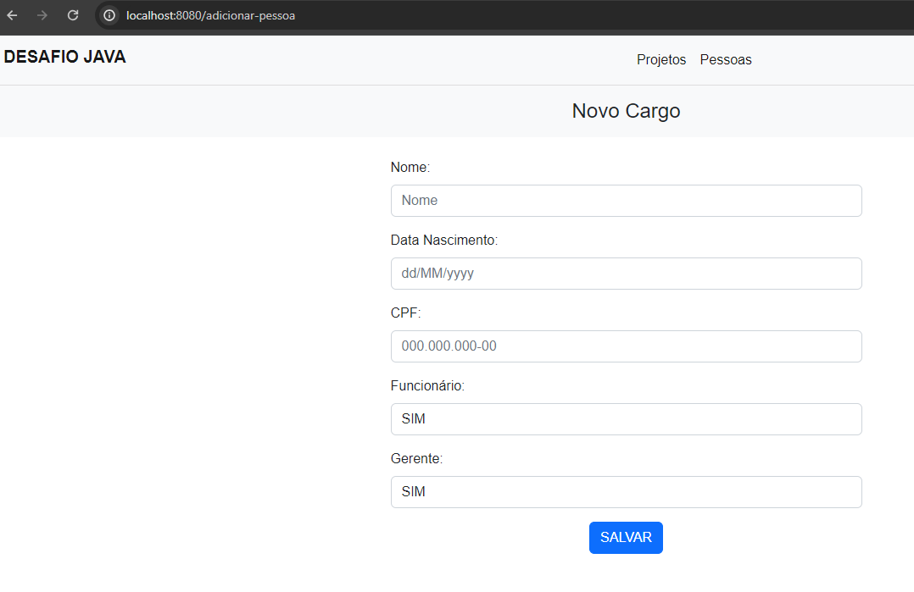

## Rodando o projeto

### Usando Maven + Spring Boot


Rodar o projeto
```shell
mvn spring-boot:run
```

[Acesse projeto](http://localhost:8080/)


Parar o projeto
```shell
mvn spring-boot:stop
```

[Acesse projeto](http://localhost:8080/)


### Usando Docker-compose

```shell
docker-compose -f docker/docker-compose.yaml up
```

### Usando SonarCloud

[Acesse o SonarCloud](https://sonarcloud.io/project/overview?id=MouseWeb_projeto-jsp2)

### Aqui estão os prints das telas do sistema:

Tela da listagem de projetos



Tela de cadastro do projeto


Tela de atualização de um projeto


Tela com mensagem de validação (O status EM ANDAMENTO não permite exclusão.)


Tela com mensagem de validação (O status ENCERRADO não permite exclusão.)


Tela com mensagem de validação (O status INICIADO não permite exclusão.)


Tela da listagem de pessoas


Tela de cadastro de uma nova pessoa




   
